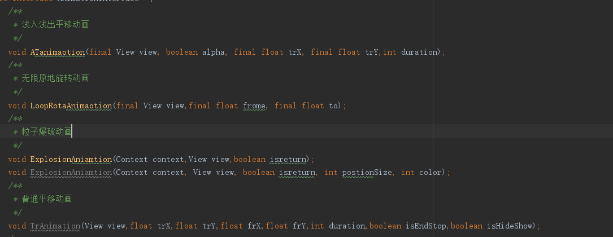
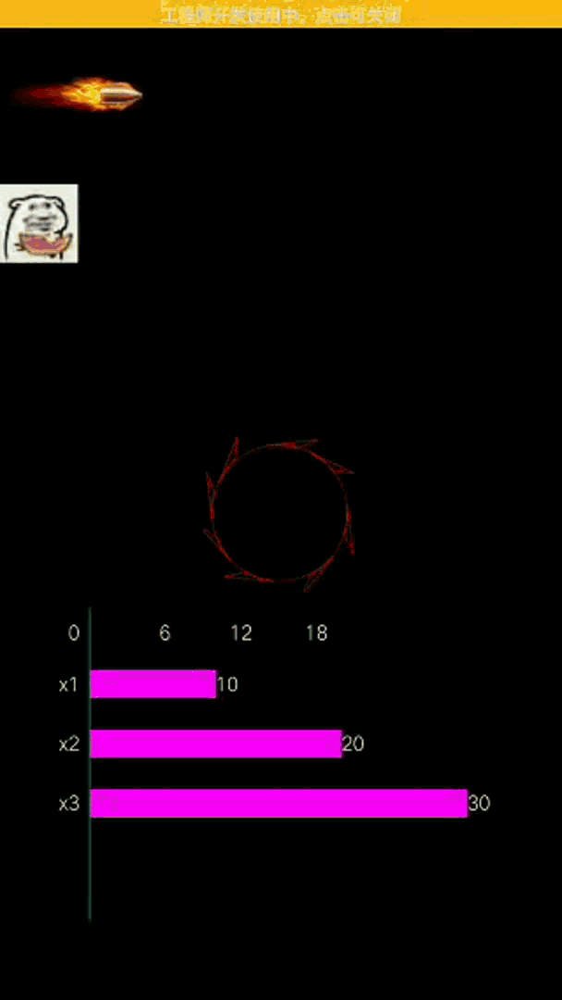
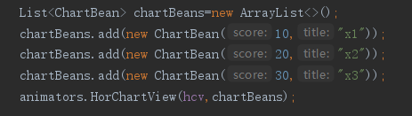
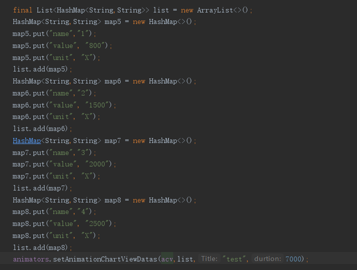
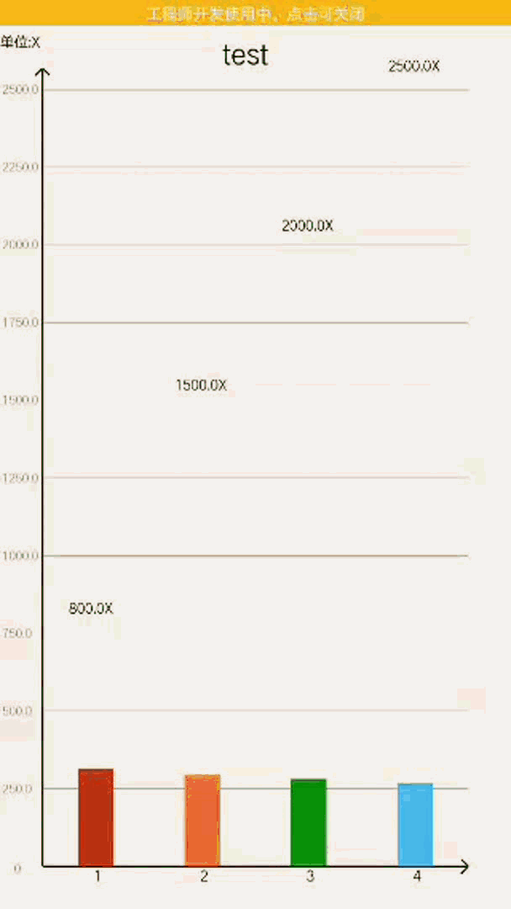

# Make
 集合了一些方便个人使用的各种方法
  ## 4.1添加内容
      compileOnly 'de.robv.android.xposed:api:82'
      allprojects {
		repositories {
			...
			maven { url 'https://jitpack.io' }
		}
	}
    
      dependencies {
	         implementation 'com.github.LaingSang.MakeAnimation:makeupanimation:4.1'
	}
     hook基础用法
     在main目录下面添加assets文件夹并新建文件xposed_init
     并在文件里填写xxx.xxx.xxx.xxHookMain字段
     在xml添加  
     <meta-data
            android:name="xposedmodule"
            android:value="true" />
        <meta-data
            android:name="xposeddescription"
            android:value="name" />
        <meta-data
            android:name="xposedminversion"
            android:value="82" />
      基础创建方法到此结束
      
      接下来是添加的方法
      新建
      HookDiaoYong dy=new HookDiaoYong();
      里面的方法,只要你是中国人肯定能看得懂
 ## 4.0添加内容
 首先导入
 
    implementation 'com.squareup.retrofit2:retrofit:2.1.0'
    implementation 'com.squareup.retrofit2:converter-gson:2.1.0'
    implementation 'com.squareup.retrofit2:adapter-rxjava:2.1.0'
    implementation 'com.squareup.okhttp3:okhttp:3.10.0'
    implementation 'com.squareup.okhttp3:logging-interceptor:3.4.1'
    
    allprojects {
		repositories {
			...
			maven { url 'https://jitpack.io' }
		}
	}
    
      dependencies {
	         implementation 'com.github.LaingSang.MakeAnimation:makeupanimation:4336751d80'
	}
 添加了Ws快速链接方法,Retrofit快速设置方法和一大堆实用的工具类具体使用方法如下
  ## Ws调用
     private WSManager ws;
     private WsStatusListener wsStatusListener=new WsStatusListener() {
        @Override
        public void onOpen(okhttp3.Response response) {
            Logs.Logshow("链接成功");

        }
        @Override
        public void onMessage(String text) {
            Logs.Logshow("收到信息:"+text);
        }

        @Override
        public void onMessage(ByteString bytes) {
            super.onMessage(bytes);
        }

        @Override
        public void onReconnect() {
            Logs.Logshow("服务器重连");
        }

        @Override
        public void onClosing(int code, String reason) {
            Logs.Logshow("服务器关闭中");
        }

        @Override
        public void onClosed(int code, String reason) {
            Logs.Logshow("服务器已关闭");
        }

        @Override
        public void onFailure(Throwable t, okhttp3.Response response) {
            Logs.Logshow("服务器连接失败");
        }
    };
    
       WsConn wsConn=new WsConn();
        wsConn.connToWsService(this,ws,wsStatusListener,"");
 ## Retrofit调用
	你自己定义的API xmRetrofitService = ChatRoomTools.getRetrofit(true(是否显示), "你自己定义的Log").create(你自己定义的API.class);
        Call<ResponseBody> call = xmRetrofitService.xxx(xxx,xxx,xxx);
        call.enqueue(new Callback<ResponseBody>() {
            @Override
            public void onResponse(Call<ResponseBody> call, Response<ResponseBody> response) {
                try {
                    String s = response.body().string().trim();
                    Logs.Logshow("返回的值"+s);
                    JSONObject jos=new JSONObject(s);
                    if (jos.optString("success").equals("true")){

                    }
                } catch (Exception e) {
                    e.printStackTrace();
                }
            }

            @Override
            public void onFailure(Call<ResponseBody> call, Throwable t) {

            }
        });
## 2.0添加内容
   此版本主要添加了一些自定义控件使用方法为如下
   ### 背景渐变控件GradualCircularView XML使用方法和普通ImgaveView一样
        GradualCircularView gradualCircularView=new GradualCircularView(this);
        int[] colors=new int[]{Color.parseColor("#ff0ff"),Color.parseColor("#ff00f"),Color.parseColor("#ff000")};
        gradualCircularView.isGradud(true,colors);
   ### 不冲突的下拉刷新ShuaXinScr 使用方法和LinearLayout类似
   ### 可以滚动的下拉选择WheelView XML使用方法直接在需要的地方放置
    WheelView whee=v.findViewById(R.id.item_wheelview_city);
        whee.setOffset(1);
        whee.setItems(list);
        whee.setSeletion(1);
        whee.setOnWheelViewListener(new WheelView.OnWheelViewListener() {
            @Override
            public void onSelected(int selectedIndex, String item) {
                xuanz[0] =item;
                z[0]=selectedIndex;
            }
        });
   ### 一个带边框的颜色块ColorChunk XML使用方法直接在需要的地方放置
   ColorChunk chunk=new ColorChunk(this);
   chunk.setColor(i_region_bean.getBackground());
 ## 1.0内容
## 主要使用方法为
	allprojects {
		repositories {
			...
			maven { url 'https://jitpack.io' }
		}
	}
 
 	dependencies  {
			implementation 'com.github.LaingSang:MakeAnimation:V1.0'
	}
 
调用比较简单只需要

实例化这个类然后调用里面的方法就行了

动画示例

横向柱子图的使用方法

柱子图的使用方法

柱子图示例

