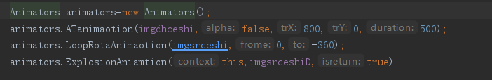

# MakeAnimation
个人使用的一些动画 目前只集合了淡入淡出平移动画，原地无限旋转动画，粒子爆破动画，一个带动画的柱状图，圆形图片view等功能
 
## 主要使用方法为
	allprojects {
		repositories {
			...
			maven { url 'https://jitpack.io' }
		}
	}
 
 	dependencies  {
			implementation 'com.github.LaingSang:MakeAnimation:V1.0'
	}
 
调用比较简单只需要

实例化这个类然后调用里面的方法就行了
